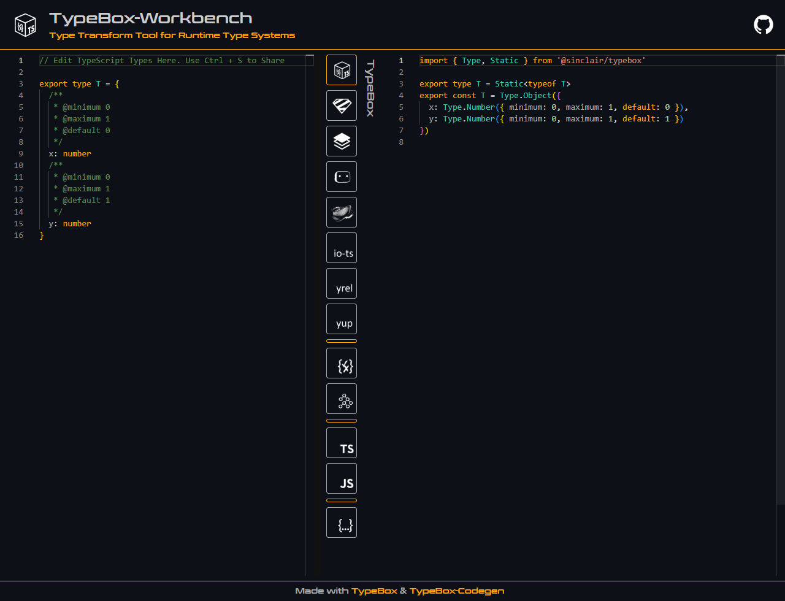

<div align='center'>

<h1>TypeBox-Workbench</h1>

<p>Type Transform Tool for Runtime Type Systems</p>

<a href="https://sinclairzx81.github.io/typebox-workbench/"></a>

</div>

## Overview

TypeBox Workbench is a browser based compiler tool that transforms TypeScript types into TypeBox types as well as types for several other ecosystem libraries. The tool is mostly written as a prototyping and debugging utility for TypeBox, but can be used as a simple copy paste utility to quickly convert existing TS types into runtime safe types.

[TypeBox Workbench Here](https://sinclairzx81.github.io/typebox-workbench/)

License MIT

## Running Locally

Use the following to run this project locally.

```bash
$ git clone git@github.com:sinclairzx81/typebox-workbench.git
$ cd typebox-workbench
$ npm install
$ npm start
```
